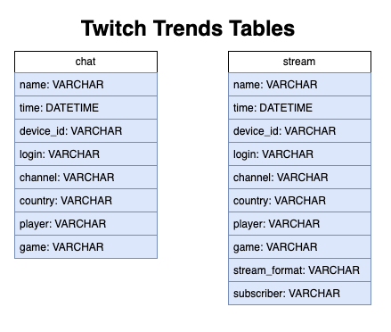
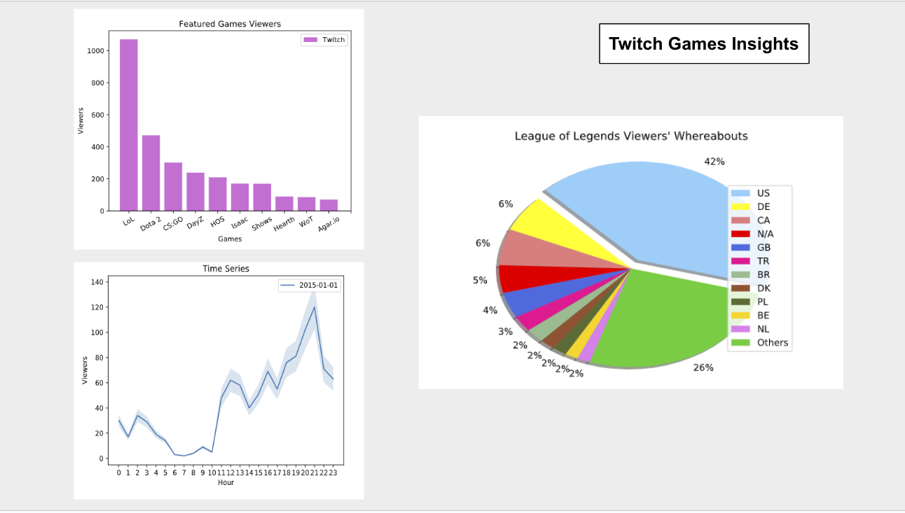

# gaming_trends

# SQL Queries
Open the 'queries.sqlite' file to see my queries for exploring and analyzing some trends with Twitch users. See the following image to understand the structure of these tables.

# Python Visualizations
Open the 'visualizations.py' file to see my Python code for building three different charts with the Twitch data. The 'twitch_trends.pdf' will display the visualizations that my code produces

